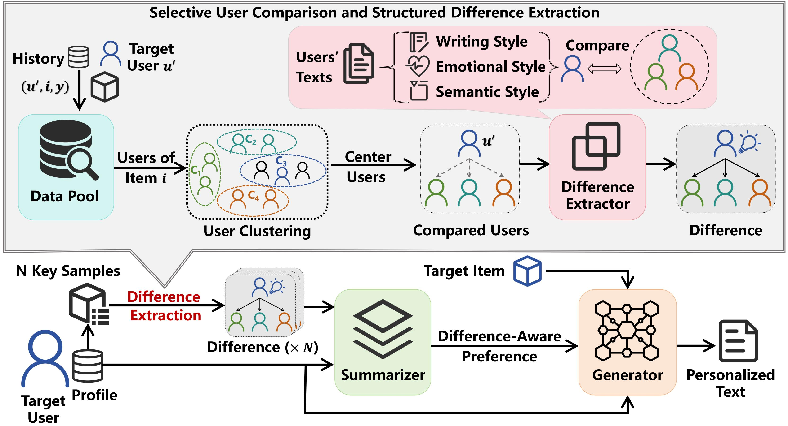
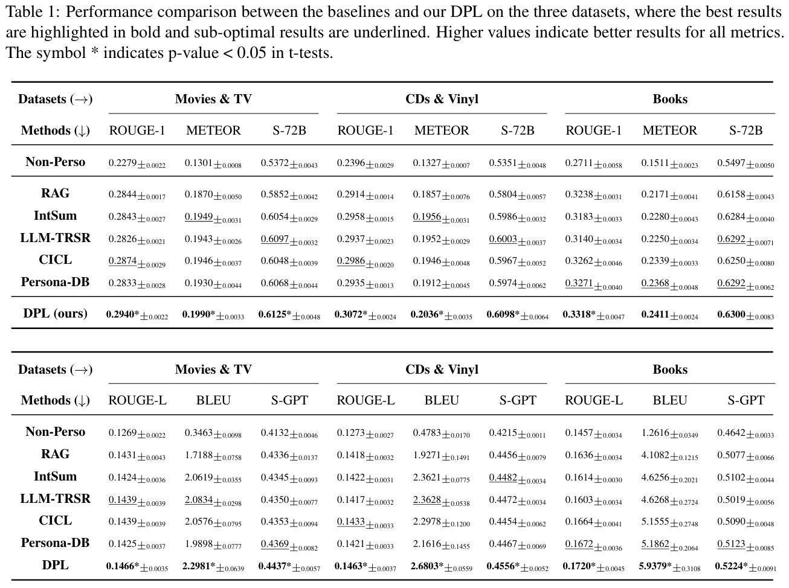

<div align=center>

<h1>Measuring What Makes You Unique: Difference-Aware User Modeling for Enhancing LLM Personalization</h1>

[](https://arxiv.org/abs/2503.02450) [](https://huggingface.co/datasets/SnowCharmQ/DPL-main) [](https://huggingface.co/datasets/SnowCharmQ/DPL-meta) [](https://huggingface.co/datasets/SnowCharmQ/DPL-Yelp) 

<div>
    <a href="https://snowcharmq.github.io/" target="_blank">Yilun Qiu</a><sup>1</sup><sup>*</sup>,
    <a href="https://xyzhao01.github.io/" target="_blank">Xiaoyan Zhao</a><sup>2</sup><sup>*</sup>,
    <a href="https://zyang1580.github.io/" target="_blank">Yang Zhang</a><sup>1</sup><sup>†</sup>,
    <a href="https://baiyimeng.github.io/" target="_blank">Yimeng Bai</a><sup>3</sup>,
    <a href="https://wenjiewwj.github.io/" target="_blank">Wenjie Wang</a><sup>3</sup>,
    <a href="https://www1.se.cuhk.edu.hk/~hcheng/" target="_blank">Hong Cheng</a><sup>2</sup>,
    <a href="https://fulifeng.github.io/" target="_blank">Fuli Feng</a><sup>3</sup>,
    <a href="https://www.chuatatseng.com/" target="_blank">Tat-Seng Chua</a><sup>1</sup>

<div>
  <sup>1</sup>National University of Singapore, <sup>2</sup>The Chinese University of Hong Kong, <sup>3</sup>University of Science and Technology of China
       </div>   
<div>
<sup>*</sup>Equal Contribution, <sup>†</sup>Corresponding author
   </div>

</div>
</div>

<br/>

This is the implementation of the Difference-aware Personalization Learning (DPL) method proposed in our paper accepted by **ACL 2025 Findings**.




<p id="Catalogue"></p>  

## 📋 Catalogue 

- [📋 Catalogue](#-catalogue)
- [⚙️ Environment Setup](#️-environment-setup)
- [📚 Dataset Preprocess](#-dataset-preprocess)
- [⌛️ Quick Start](#️-quick-start)
- [📊 Experimental Results](#-experimental-results)
- [📖 Citation](#-citation)

## ⚙️ Environment Setup

```
conda create -n DPL python=3.11.11
conda activate DPL
pip install -r requirements.txt
```

## 📚 Dataset Preprocess

The dataset we used in DPL is adapted from [Amazon Reviews'23](https://amazon-reviews-2023.github.io/). We publish our processed datasets in Huggingface. You can also process the dataset yourself and store it locally by the following commands:

```
cd data/
./create.sh
```

## ⌛️ Quick Start

To execute the DPL method, please first complete the required information in the `.env` file. Then, run the following command:

```
./main.sh
```

You can modify the `main.sh` file to change parameters.

## 📊 Experimental Results



## 📖 Citation

If you find our work useful, please kindly cite our paper:

```
@article{qiu2025measuring,
  title={Measuring What Makes You Unique: Difference-Aware User Modeling for Enhancing LLM Personalization},
  author={Qiu, Yilun and Zhao, Xiaoyan and Zhang, Yang and Bai, Yimeng and Wang, Wenjie and Cheng, Hong and Feng, Fuli and Chua, Tat-Seng},
  journal={arXiv preprint arXiv:2503.02450},
  year={2025}
}
```
