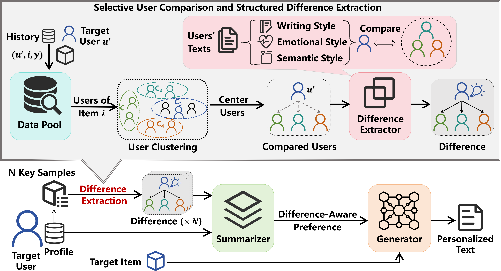

# Difference-aware Personalized Learning (DPL)

This is the implementation of the DPL method proposed in our paper:

> [Measuring What Makes You Unique: Difference-Aware User Modeling for Enhancing LLM Personalization](https://arxiv.org/abs/2503.02450)
> 
> Yilun Qiu, Xiaoyan Zhao, Yang Zhang, Yimeng Bai, Wenjie Wang, Hong Cheng, Fuli Feng, Tat-Seng Chua



## Environment Setup

```
conda create -n DPL python=3.11.11
conda activate DPL
pip install -r requirements.txt
```

## Dataset Preprocess

The dataset we used in DPL is adapted from [Amazon Reviews'23](https://amazon-reviews-2023.github.io/). We publish our processed [main dataset](https://huggingface.co/datasets/SnowCharmQ/DPL-main) and [meta dataset](https://huggingface.co/datasets/SnowCharmQ/DPL-meta) in Huggingface. You can also process the dataset yourself and store it locally by the following commands:

```
cd data/
./create.sh
```

## Main Experiments

To execute the DPL method, please first complete the required information in the `.env` file. Then, run the following command:

```
./main.sh
```

You can modify the `main.sh` file to change parameters.

## Reference

If you find our work useful, please kindly cite our paper:

```
@article{qiu2025measuring,
  title={Measuring What Makes You Unique: Difference-Aware User Modeling for Enhancing LLM Personalization},
  author={Qiu, Yilun and Zhao, Xiaoyan and Zhang, Yang and Bai, Yimeng and Wang, Wenjie and Cheng, Hong and Feng, Fuli and Chua, Tat-Seng},
  journal={arXiv preprint arXiv:2503.02450},
  year={2025}
}
```